# SKCorp-IAM-Operations-Access-Governance-Lab

## Project Overview

This project demonstrates an enterprise-style Identity and Access Management lab built with Windows Server 2022, Active Directory Domain Services, DNS, a domain-joined Windows 11 endpoint, RBAC security groups, Joiner-Mover-Leaver workflows, file-share authorization, delegated administration, and PowerShell-based access review reporting.

The lab simulates a small company environment called **SKCorp** and shows how identities are created, assigned access, modified during role changes, deprovisioned after termination, and reviewed for access governance.

## Lab Environment

| Component | Purpose |
|---|---|
| Windows Server 2022 | Domain Controller, DNS, AD DS, file shares |
| Windows 11 Pro | Domain-joined client workstation |
| VMware Workstation | Virtualization platform |
| Active Directory | Identity store and authentication provider |
| PowerShell | Access review automation |

## Architecture

```text
Windows Server 2022: DC01
        |
        |-- Active Directory Domain Services
        |-- DNS
        |-- Organizational Units
        |-- Security Groups / RBAC
        |-- HR and Finance File Shares
        |-- PowerShell Access Review Report

Windows 11: WIN11-CLIENT01
        |
        |-- Joined to skcorp.local
        |-- Domain user authentication
        |-- Access testing for HR and Finance users
```

## Objectives

- Build an Active Directory domain using Windows Server 2022.
- Create a structured OU model for users, groups, workstations, service accounts, and disabled users.
- Implement role-based access control using AD security groups.
- Simulate Joiner-Mover-Leaver identity lifecycle workflows.
- Enforce access control using NTFS and SMB permissions.
- Configure delegated password reset administration for a Helpdesk role.
- Automate user access review reporting with PowerShell.

---

## 1. Server and Domain Setup

The lab begins with Windows Server 2022 configured as the domain controller **DC01**. Active Directory Domain Services and DNS were installed to support the domain `skcorp.local`.

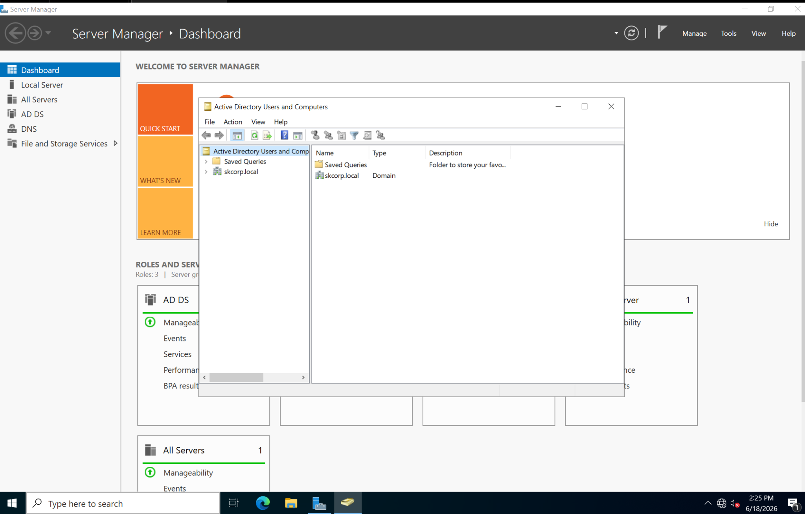

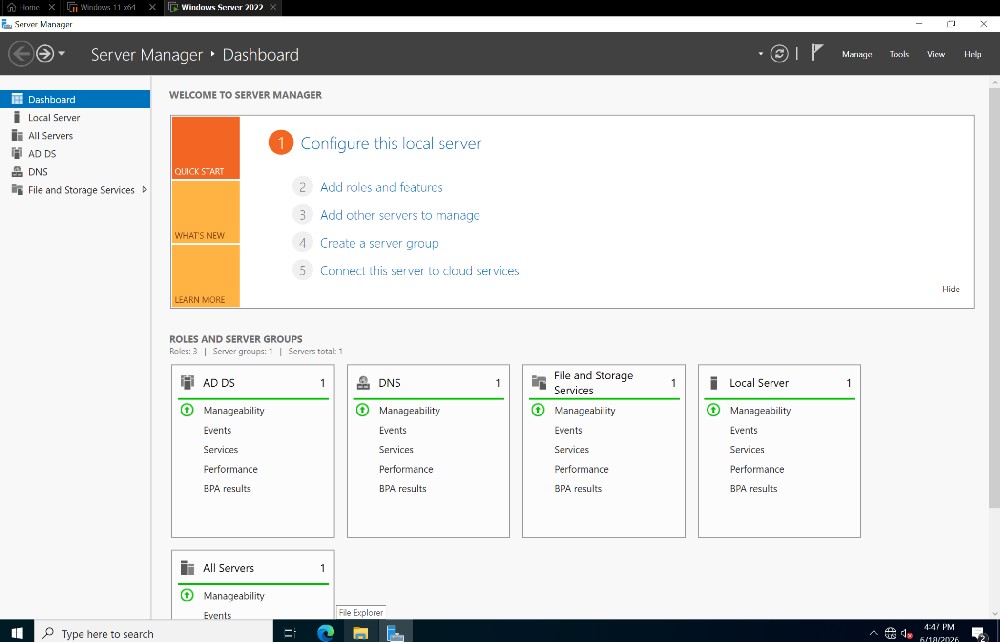

---

## 2. Active Directory OU and RBAC Design

A dedicated parent OU named **SKCorp** was created to organize identities and resources.

OU structure:

```text
SKCorp
|-- Users
|-- Groups
|-- Servers
|-- Workstations
|-- Service Accounts
|-- Disabled Users
```

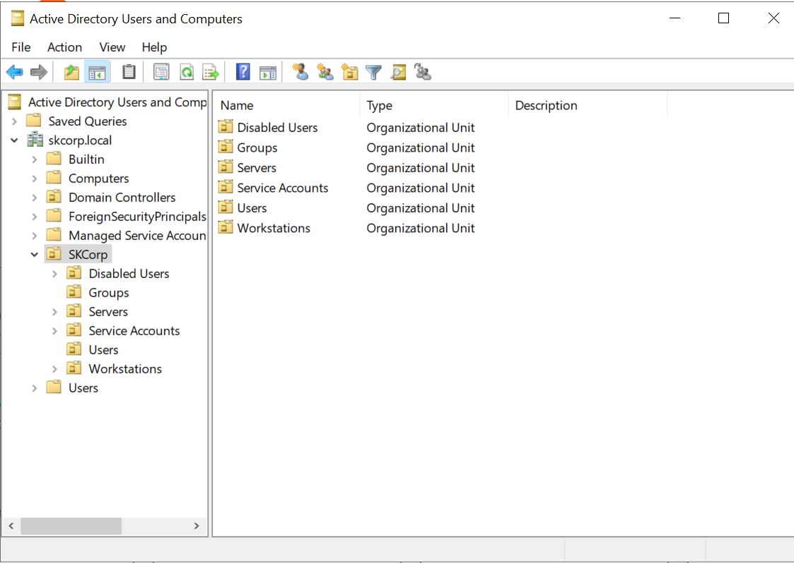

Security groups were created to support RBAC:

- HR-Users
- Finance-Users
- Finance-Managers
- IT-Users
- VPN-Users
- Helpdesk-PasswordReset

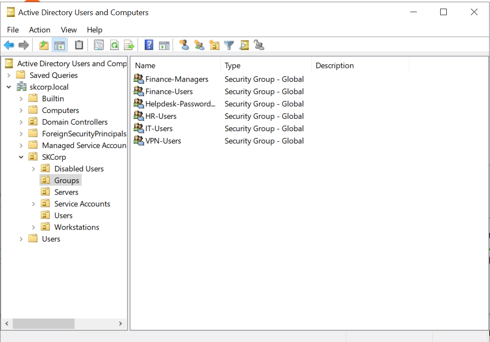

User accounts were created inside the SKCorp Users OU.

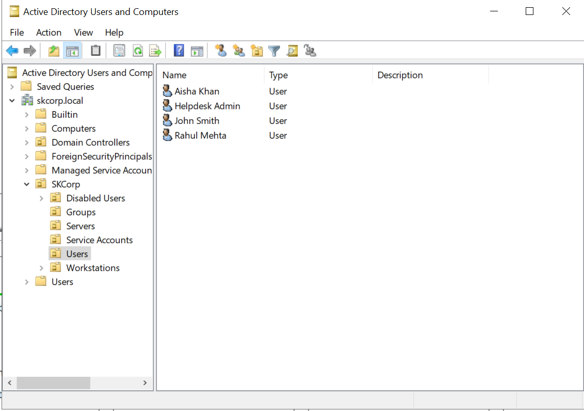

---

## 3. Joiner-Mover-Leaver Lifecycle Management

### Joiner

A new employee account was created and assigned initial access based on job role.

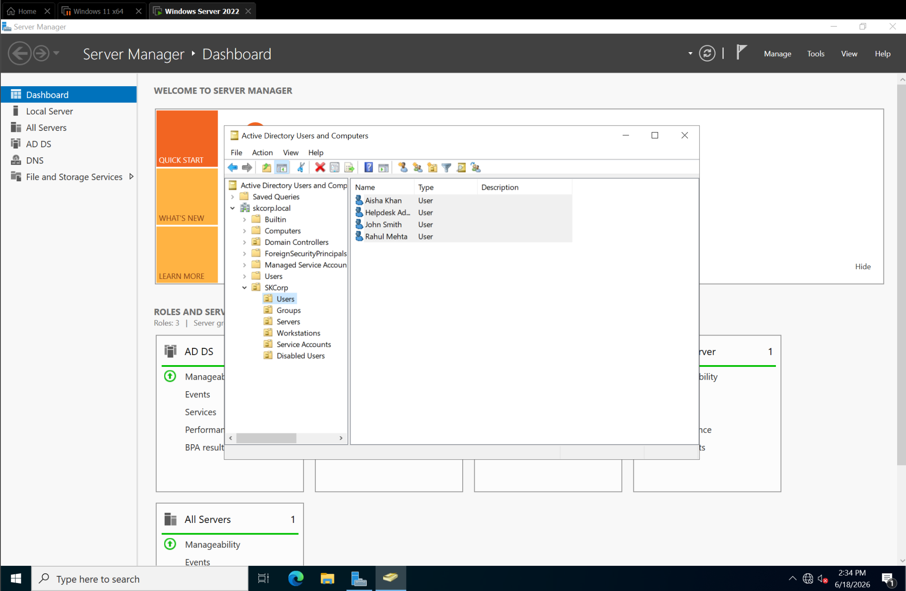

### Mover

Sarah Wilson was moved from HR access to Finance access by removing old groups and adding new role-based groups.

Before mover process:

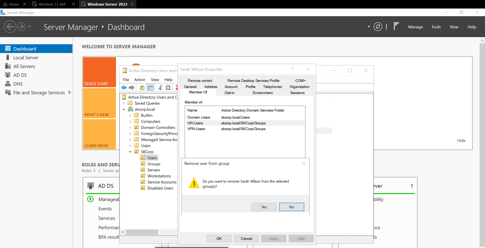

Group membership validated from the domain-joined Windows 11 workstation using `whoami /groups`.

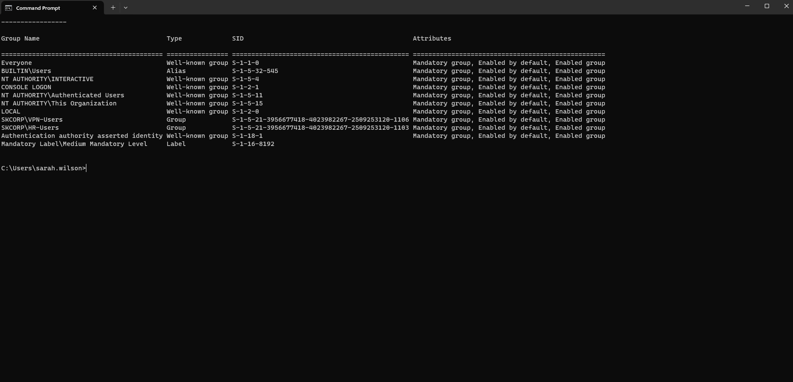

After mover process:

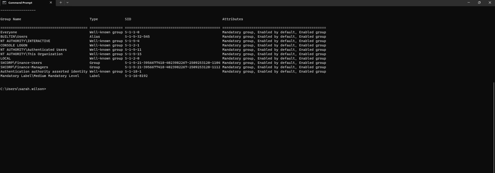

### Leaver

The leaver workflow disabled the user account, removed access, and moved the user into the Disabled Users OU.

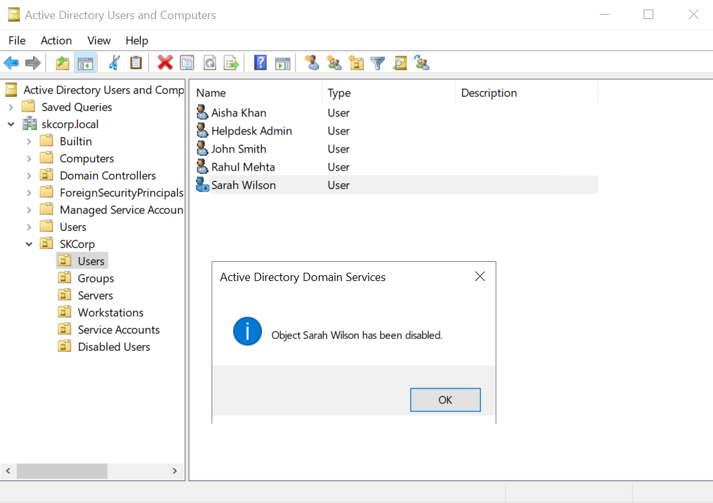

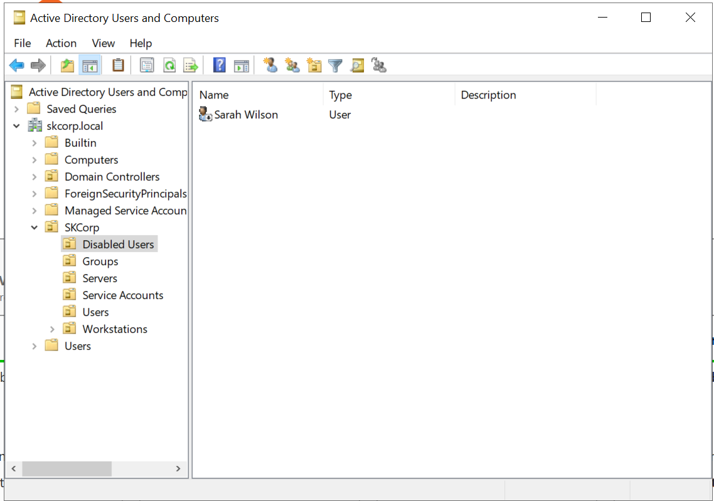

A login attempt confirmed the disabled account could no longer authenticate.

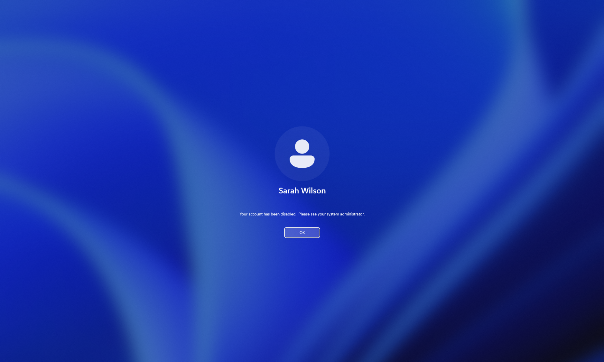

---

## 4. Delegated Helpdesk Administration

The Helpdesk role was delegated permission to reset user passwords and force password changes at next login without granting Domain Admin privileges. This demonstrates least-privilege administration.

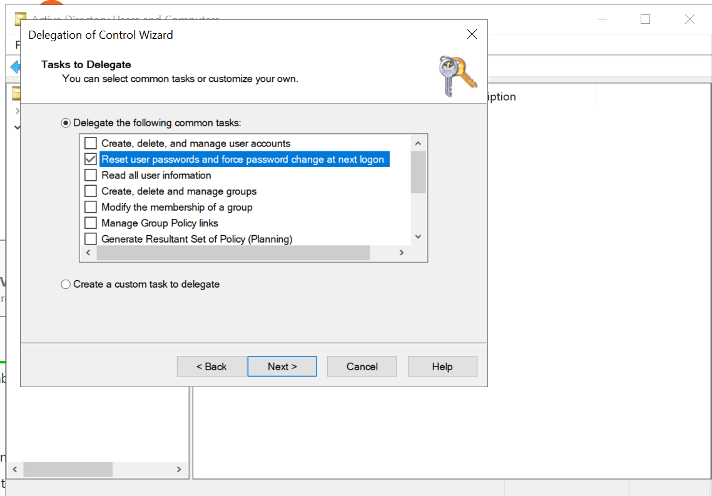

---

## 5. RBAC File Share Authorization

Two departmental shares were created:

```text
\\DC01\HR
\\DC01\Finance
```

Access was controlled through AD security groups and NTFS/SMB permissions.

| User | Group | HR Share | Finance Share |
|---|---|---|---|
| Aisha Khan | HR-Users | Allowed | Denied |
| Rahul Mehta | Finance-Users, Finance-Managers | Denied | Allowed |

Aisha could access the HR share but was denied access to the Finance share.

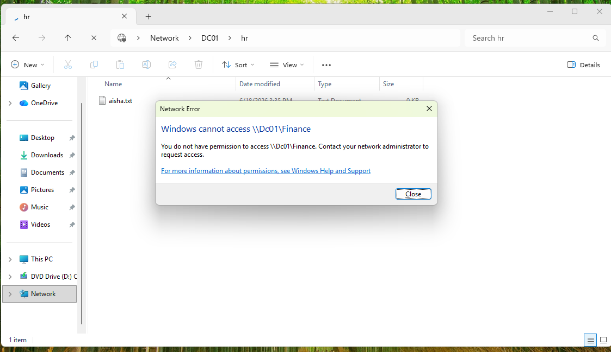

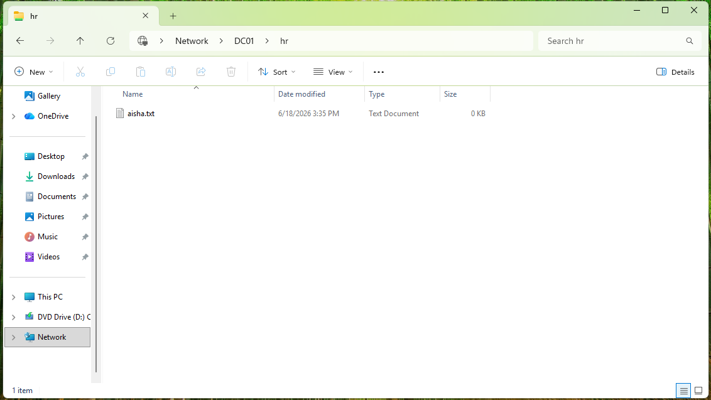

---

## 6. PowerShell User Access Review Automation

A PowerShell script was created to export user group memberships into a CSV report. This simulates an IAM access review or entitlement review.

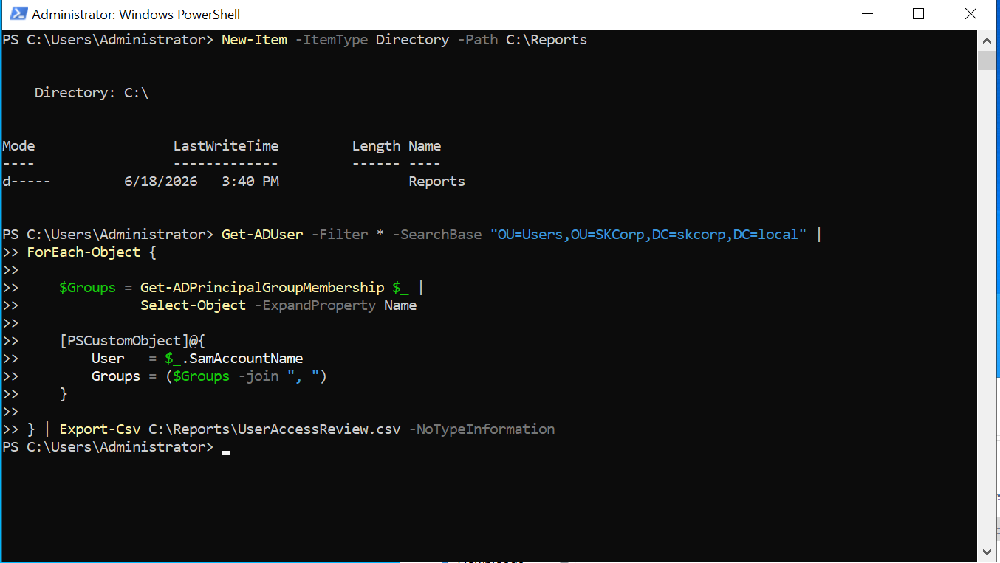

Generated CSV report:

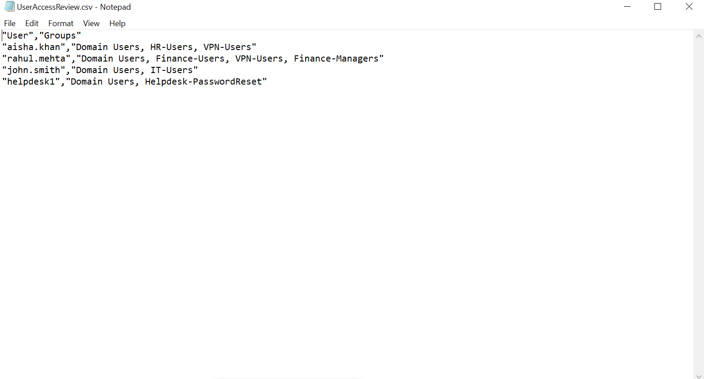

Script location: [`scripts/UserAccessReview.ps1`](scripts/UserAccessReview.ps1)

---

## Key IAM Concepts Demonstrated

- Identity lifecycle management
- Joiner-Mover-Leaver workflows
- Active Directory administration
- Domain authentication
- Role-based access control
- Least privilege
- Delegated administration
- NTFS and SMB authorization
- User access reviews
- PowerShell automation
- Access governance reporting
